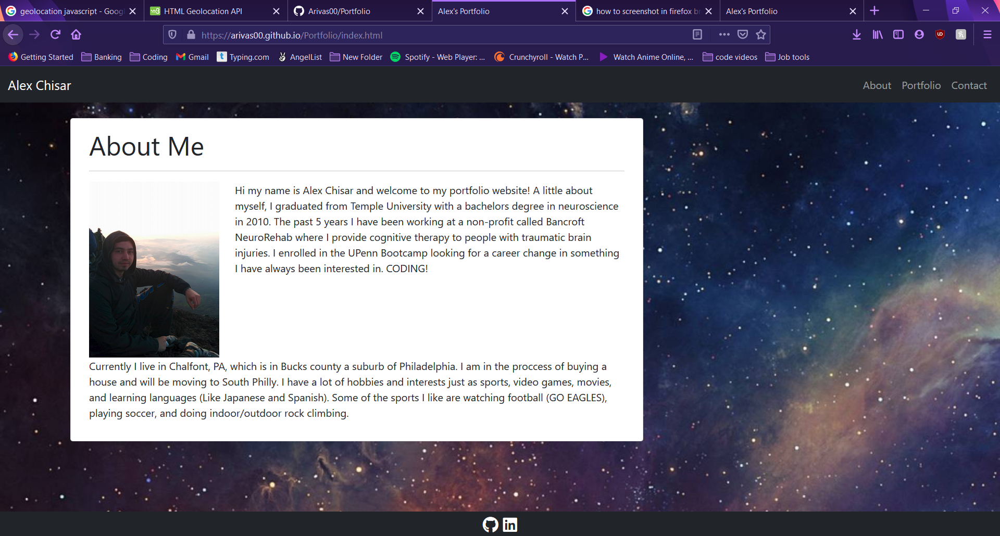
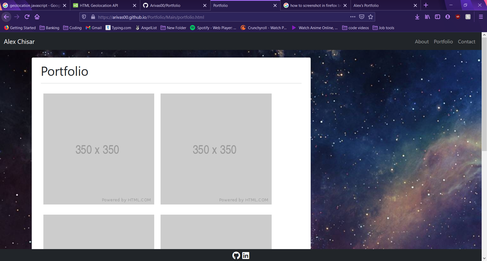
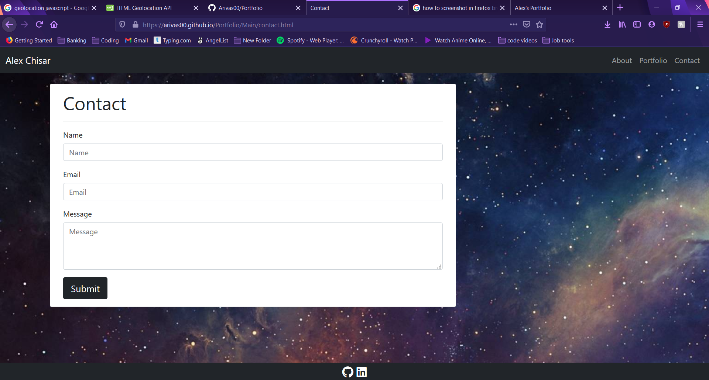

# My Portfolio

## Application Webpage

https://arivas00.github.io/Portfolio/

```
Deployed with Github pages.

```

## Developer Notes

```
My first portfolio created from scratch using Bootstrap CSS framework.
3 diffrent pages were created, index page, portfolio page, and contact page.
Each page has a nav bar with a responsive layout, responsive images and footer with links to social account.
Semantic HTML was used for each page.
Pages utilize Bootstrap components and grid system.  

```


## Screenshot of application.

The following image shows the web application's appearance and functionality:





